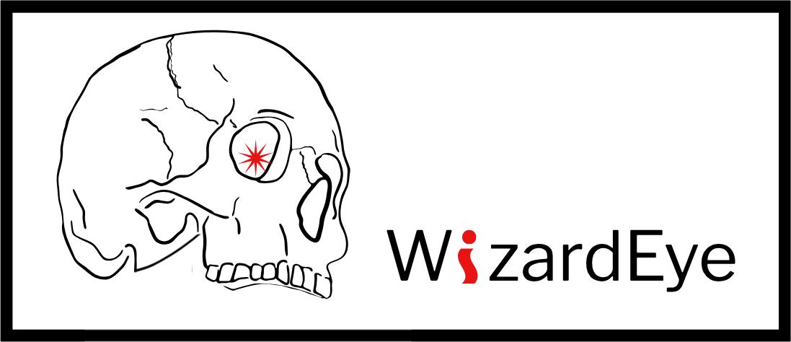

# WizardEye

WizardEye is a Python tool that filters aligned reads according to the risk of ambiguous alignment sources on a reference genome. To do this, WizardEye first identifies all positions in your reference genome that can be targeted by reads from known ambiguous sources using your alignment parameters. For example, it can be used to filter out reads in your alignment that map to regions conserved between your reference genome and several potentially contaminating organisms.



**WizardEye is currently in beta and under active development. Future updates will bring new features, improve stability, and ensure robustness through comprehensive unit testing.**


The tool is designed both to create a database containing several reference genomes and their associated risky sources, and to filter BAM files according to that stored information. By directly using `bwa`, WizardEye can empirically identify risky reads based on your frequently used alignment parameters.

This tool is directly adapted from the script [generate_cross_mappability_filter_bwa.sh](https://github.com/TheLokj/generate_cross_mappability_filter/blob/master/BWA/generate_cross_mappability_filter_bwa.sh).

## Table of Contents

- [How it works](#how-it-works)
- [WizardEye limits](#wizardeye-limits)
- [Installation](#installation)
	- [Dependencies](#dependencies)
- [Usage](#usage)
	- [Create the database](#create-the-database)
	- [Create a new track](#create-a-new-track)
	- [Filter a BAM file](#filter-a-bam-file)
	- [Export a mask](#export-a-mask)
	- [Import an existing track manually](#import-an-existing-track-manually)
- [Go beyond WizardEye limits](#go-beyond-wizardeye-limits)

## How it works

WizardEye first splits the potential contaminant source into `-k`-mers with a sliding window of `-w`. It then aligns each produced unique k-mer using `bwa aln` with your parameters on the target reference to highlight ambiguous regions of that sequence. As this step can be computationally intensive for a complete genome, it stores the computed cross-mappability track in a database.

You can then use these cross-mappability tracks to filter your alignment. For example, if you are studying the evolution of *Hominidae* and align your reads to the human genome, you can use WizardEye to remove reads that could also come from other mammalian sources, such as hyena or deer, using several cross-mappability tracks generated from non-Hominidae mammalian genomes.

## WizardEye limits

As WizardEye is based only on alignment and prior knowledge, it is recommended to use it when you have an idea of the types of contamination that may be present in the sample. The more exhaustive the database, the more efficient (and restrictive) the filtering.

Please also note that WizardEye is only designed to identify ambiguous regions **that can align**. This tool **cannot** be used to filter out sequences that are very distant from the target. It is therefore highly recommended to use it as a complementary step to traditional large-scale filtering. Finally, note that WizardEye filtering can be very strict and lead to the loss of substantial information, prioritizing risk avoidance over the statistical power of post-hoc analyses.

## Installation

You can install WizardEye by cloning this repository and by running the following commands from the main folder:

```
python3 -m venv .wizardeye
source .wizardeye/bin/activate
python -m pip install -U pip
python -m pip install -e .
```

### Dependencies

WizardEye relies on both Python packages and external command-line tools.

### External tools (called with subprocess)

Required:

- `bwa` (alignment and indexing)
- `samtools` (SAM/BAM conversion, sorting, concatenation)
- `seqkit` (k-mer generation, deduplication, chunking)
- `bedGraphToBigWig` (UCSC tool, package often named `ucsc-bedgraphtobigwig`)
- `bigWigToBedGraph` (UCSC tool, package often named `ucsc-bigwigtobedgraph`)
- `bedtools` (faster interval merging in mask generation)
- standard Unix tools: `awk`, `sort`, `cat` (used in high-performance paths)

### Python packages

Required:
- `typer` (CLI)
- `PyYAML` (database and track metadata YAML files)
- `pysam` (BAM parsing and interval extraction)

## Usage

### Create the database

You should initially create a WizardEye database using the following command:

```
wizardeye database --init /path/to/database
```

#### About the database

The database is a directory containing sub-directories representing targets and already processed tracks.

```
database/
├── hg19/                           # reference
│   ├── sus_scrofa_k35_w1_n1_o2_l1/ # a track divided and aligned on the reference
│   │   ├── map_all.bw      	    # all overlapping k-mers
│   │   ├── map_uniq.bw             # unique overlapping k-mers
│   │   └── info.yaml               # information about the track
...
│   ├── ref.md5                     # reference md5
│   └── ref.yaml                    # information about the reference
└──  info.yaml                      # information about the database
```

Every subdirectory contains two `bigWig` files that can be opened in a traditional genome browser. The `map_all.bw` file represents, for every position of the `reference.fa` genome, the number of overlapping k-mers from the `risky` sequences, while `map_uniq.bw` contains only unique k-mers, i.e., k-mers that overlap only this area of the genome. These two files allow you to compute stringency.

##### Update a track

You can update tags of an existing track from the database command by providing the full track-defining parameters and the replacement tags:

```
wizardeye database --update-track-tags -d /path/to/database \
	-r hg19 --track bos_taurus -k 35 -w 1 -bn 0.01 -bo 2 -bl 16500 \
	--tags Mammalia,Ruminantia
```

##### Database cache

Note that masks generated during filtration are cached in the database, to make next filtrations quicker. You can avoid that specifying `--no-cache` before filtration> You can delete the cache using the following command:

```
wizardeye database --clean -d /path/to/database
```

### Create a new track

You can compute ambiguous regions of `reference.fa` that can be aligned, using specific BWA parameters, by reads from `risky.fa` with:

```
wizardeye align -i /path/to/risky.fa -r /path/to/reference.fa -d /path/to/database \ 
					-k k_mer_length -w sliding_windows \
					-bn bwa_missing_prob_err_rate -bo bwa_max_gap_opens -bl bwa_seed_length
```

You can manually set a track identifier with `--track_ID` (alias `--track-id`) to quickly describe where the sequence comes from. This identifier is appended to the track name based on the FASTA filename stem:

```
wizardeye align -i /path/to/risky.fa -r /path/to/reference.fa -k 35 -w 1 --track_ID GCA_4815162342 -bn 0.01 -bo 2 -bl 16500
```

WizardEye stores the MD5 of the input FASTA (`input_fasta_md5`) in `param.yaml`, in addition to the reference MD5. 

Note that you can provide tags here to describe `risky.fa`. This can be used to describe the sequence, for example by specifying phylogeny and/or a particular environment: `-t Mammalia,Carnivora,Felis,Cave`. This is useful to filter a `.bam` file directly according to specific tags.

Note also that, to prevent misuse, it is not possible to add a new track to the database if the reference alignment file is not exactly the same, including sequence names. This is due to an MD5-based control to avoid silently corrupted analyses.

### Filter a BAM file

Once you have a representative database, you can use it to filter out reads from your alignment. To do that, you can enter:

```
wizardeye filter -i alignment.bam -r hg19 --exclude-tags Cave -k 35 -s 1 -bn 0.01 -bo 2 -bl 16500 -d /path/to/database
```

This will filter out all reads that can be ambiguously aligned to your target if they come from a source with a tag listed in `--exclude-tags`. 

For `filter`, `-r` must be the reference identifier already present in your WizardEye database (for example `hg19`), and `-d/--db-root` is mandatory.

By default, WizardEye only considers reads that can be aligned with a single position in the reference. However, if you want to exclude reads that can be aligned with multiple positions, and then be even more restrictive, specify the additional parameter `--considere-all`.

You can also filter out reads based on specific tracks:

```
wizardeye filter -i alignment.bam -r hg19 --exclude-tracks myotis_alcathoe,ursus_arctos -d /path/to/database
```

If sequence naming differs between BAM and tracks (for example `chr1` vs `1`), filtering stops with an explicit error. Harmonize contig names beforehand.

Note that, by default, the tool excludes a read if at least **one base** of the read overlaps one of the tracks. **[Not implemented yet]**: You will be able to specify `--trim` to be more tolerant and split reads according to the mask, keeping the parts of reads that are not present in tracks.

#### Adjust the filter hardness

##### Stringency 

To handle the trade-off between sensitivity and specificity, you can specify a stringency value during filtering. This criterion is defined as described below.

For a position $P$ in the target, there are exactly `-k`/`-s` different possible k-mers that overlap that position perfectly. After mapping, among the `n` k-mers overlapping the position (maximum `-k`/`-s` if no mismatches are allowed, otherwise more), `u` is computed as the number of these k-mers that are unique in the target. The position is then highlighted as ambiguous if `u`/(`-k`/`-s`) >= `-rc`, i.e., if the proportion of unique k-mers overlapping the position compared with the total number of possible k-mers overlapping the position is higher than the stringency.

For example, in a situation with one mismatch allowed, with `-k=40` and `-rc=0.25`, if a position is overlapped by 10 exact k-mers and 10 k-mers with one mismatch, the position is retained only if 10 of these k-mers are unique, regardless of exactness. In a similar case with `-rc=0.50`, the region is highlighted only if all 20 k-mers map uniquely there.

```
wizardeye filter -i alignment.bam -r hg19 --exclude-tracks myotis_alcathoe,ursus_arctos -s 0.25 -d /path/to/database
```

Note that the ratio is not weighted by depth. In another case with a repetitive region, where a position is overlapped by 3000 k-mers, the ratio is still the same: if 40 of these are unique, the position is highlighted.

Unique k-mers are defined as the k-mers without BWA `XA` tag and with `MAPQ>0`. 

This behavior aims to reproduce the [Heng Li's seqbility](https://github.com/lh3/misc/tree/cc0f36a9a19f35765efb9387389d9f3a6756f08f/seq/seqbility) logic, which is not directly usable in a cross-mappability context. 

If `--considere-all` is used, the same behavior and formulae are still used but uniqueness is simply no longer required.

##### Frequency

*[Not implemented yet]*

The position will only be masked if at least `-mf` tracks overlap that position.

```
wizardeye filter -i alignment.bam -r hg19 --exclude-tracks myotis_alcathoe,ursus_arctos -f 3 -d /path/to/database
```

If the `-by_tags` parameter is used, frequency is computed per tag rather than per track. A position is then masked only if there is overlap from tracks belonging to the specified tags, where `-f` represents the number of tags that must be represented. For example, here, a read is masked only if it has a position overlapped by a combination of 2 of the specified clades.

```
wizardeye filter -i alignment.bam -r hg19 --exclude-tracks myotis_alcathoe,ursus_arctos -f 2 -by_tags Carnivora,Ruminant -d /path/to/database
```

#### Output

WizardEye produces a tabulation-separated report containing, for each read, the decision and the overlapping tracks and tags, such as follows: 


| read_id                                  | excluded | overlapped | tags |
|------------------------------------------|----------|------------|------|
| read_1								   | true  	  | sus_scrofa,bos_taurus | Suina,Ruminantia |
| read_2								   | false    |            |      |
| read_3								   | true     | felis_catus | Feliformia     |
| read_4								   | true     | bos_taurus | Ruminantia     |
| read_5								   | true    | bos_taurus,ovis_aries           | Ruminantia     |
| read_6								   | false    |          |      |

With `--export-bam`, WizardEye produces two more files:

- a BAM `excluded` with the reads excluded by the filtration,
- a BAM `filtered` with the reads kept by the filtration,

### Export a mask

If you plan to use the same configuration often to filter your reads, it is highly recommended to export a mask in order to avoid recomputing it continuously:

```
wizardeye export -r hg19 --exclude-tags Cave -k 35 -s 1 -bn 0.01 -bo 2 -bl 16500 -d /path/to/database -o mask.bed
```

### Import an existing track manually

If you already computed a track outside WizardEye, you can import it manually by providing both BigWig files and the parameters that were used to generate them:

```
wizardeye import -d /path/to/database -r ref -i input -k 35 -w 20 \
	--map-all-bw /path/to/map_all.bw \
	--map-uniq-bw /path/to/map_uniq.bw \
	--reference-fasta /path/to/reference.fa \
	--input-fasta /path/to/input.fa \
	-bn 0.01 -bo 2 -bl 16500 -j 8 \
	-t Mammalia,Carnivora
```
This command creates the target/track directory, copies the two BigWig files as `map_all.bw` and `map_uniq.bw`, and writes a `param.yaml` with the provided generation metadata.

# Go beyond WizardEye limits

*[Not implemented yet]*

Note that you can specify a Kraken output using `-kro /path/to/input` and `-krl level_of_filtering` in order to complete your filtering using the Kraken evolution-related method. This combination is useful to remove both reads that belong to completely different organisms and reads that can be ambiguous between closely related organisms.

*Last update of this documentation: beta-0.0.3.*